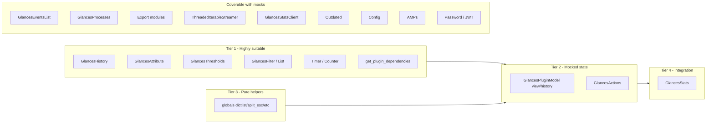

# State-based testing: components overview

This document summarises which parts of the Glances codebase are suitable for the methodology in [exploration.md](exploration.md): an agent-written randomised state-based generator that drives the public API of a component over many iterations, then uses crashes to refine specifications and find bugs.

---

## Suitability criteria (short)

- **Clear public API** that can be invoked at random (methods with defined signatures).
- **Stateful** behaviour so that random sequences of calls can reach many states and expose ordering bugs.
- **Definable preconditions** so that failures can be classified as "wrong precondition" vs "implementation bug".
- **Testable without heavy external I/O** (or with simple mocks), so that random execution is feasible.

---

## Tier 1: Highly suitable components

1. **glances/history.py – GlancesHistory**  
   API: `add()`, `reset()`, `get()`, `get_json()`. State: dict of attributes. No I/O. Good first target.

2. **glances/attribute.py – GlancesAttribute**  
   API: `value`, `history_add`, `history_reset`, `history_raw`, `history_json`, `history_value`, `history_mean`, `history_len`. Known bug in `history_mean` (denominator uses value difference instead of count).

3. **glances/thresholds.py – GlancesThresholds**  
   API: `add(stat_name, threshold_description)`, `get(stat_name)`. Preconditions: threshold_description in `['OK','CAREFUL','WARNING','CRITICAL']`.

4. **glances/filter.py – GlancesFilter / GlancesFilterList**  
   API: `filter` setter, `is_filtered(process)`. Random filter strings and process dicts.

5. **glances/timer.py – Timer and Counter**  
   API: `set`, `reset`, `finished`, `get` (Timer); `start`, `reset`, `get` (Counter). Time may need to be mocked.

6. **glances/plugins/plugin/dag.py – get_plugin_dependencies()**  
   Pure function: plugin_name + optional graph. Random plugin names and graphs.

---

## Tier 2: Suitable with injected or mocked state

7. **glances/plugins/plugin/model.py – GlancesPluginModel (view/history/alert only)**  
   **Default: mock more.** Do **not** call `update()` (real I/O). Use one plugin (e.g. mem) with minimal init. Patch **`glances.events_list.glances_events`** (so `add()` is a no-op or mock), optionally **`glances.thresholds.glances_thresholds`** (so the plugin does not mutate the real global thresholds), and **`glances.actions.secure_popen`** (or inject a mock `GlancesActions` that no-ops `run`). With these mocks, drive `set_stats()`, `update_views()`, `update_stats_history()`, `get_views()`, `get_raw()`, `get_export()`, `get_alert()`, etc., without global or process side effects.

   **Optional – full logic coverage:** If you need full state-based coverage of the alert path (limits, %, highlight_zero, threshold/action wiring), add: drive random `(current, minimum, maximum, header, action_key, log)` and random `_limits` / `set_limits` so `get_alert` / `get_alert_log` / `manage_threshold` / `manage_action` are fully exercised.

8. **glances/actions.py – GlancesActions**  
   API: `set`, `get`, `run`. Mock `secure_popen` so `run()` does not execute commands. No additional mocks needed; component is well-scoped.

---

## Tier 3: Pure helpers (random input, no internal state)

9. **glances/globals.py**  
   `list_to_dict`, `dictlist`, `dictlist_first_key_value`, `split_esc`, `auto_unit`, etc. Random inputs to find edge cases.

---

## Tier 4: Integration-style (more setup)

10. **glances/stats.py – GlancesStats**  
    API: `load_modules`, `update_plugin`, `update`, `getPluginsList`, `get_plugin`, etc. Random sequences of update/get with minimal args and config.

---

## Coverable with mocked side effects (explicit components)

These are suitable **if** I/O or external dependencies are mocked (use `unittest.mock.patch` or equivalent unless constructor injection is noted). Each is given as an explicit component: **Location**, **API**, **State**, **Mocks**, **Notes**. Numbered 11–23 for easy reference.

---

### 11. GlancesEventsList

**Location:** glances/events_list.py – class `GlancesEventsList`.

- **API:** `set_max_events(max_events)`, `set_min_duration(min_duration)`, `set_min_interval(min_interval)`, `get()`, `len()`, `get_event_sort_key(event_type)`, `set_process_sort(event_type)`, `reset_process_sort()`, `add(event_state, event_type, event_value, proc_list=None, proc_desc="")`, `clean(critical=False)`.
- **State:** List of events (`events_list`), `max_events`, `min_duration`, `min_interval`. Events are created/updated/closed by `add()`; `clean()` removes finished items.
- **Mocks:** Patch `glances.events_list.glances_processes` (add uses `get_list()`, `set_sort_key()`, `sort_key`, `auto_sort`). Patch `glances.events_list.glances_thresholds` (build_global_message used inside add calls `get()`).
- **Notes:** Preconditions: `event_state` in `('OK','CAREFUL','WARNING','CRITICAL')`; `event_type` string. Only WARNING/CRITICAL create new events; OK/CAREFUL can close an ongoing event. Good candidate for state-based testing: random sequences of add/clean with mocked processes and thresholds.

---

### 12. GlancesProcesses

**Location:** glances/processes.py – class `GlancesProcesses`.

- **API:** `update()` (real I/O), `get_list(sorted=..., as_programs=False)`, `set_sort_key(key, auto=True)`, `update_list(processlist)`, `update_export_list(processlist)`, `reset_processcount()`, `reset_internal_cache()`, `reset_max_values()`, plus filter/cache-related methods.
- **State:** `processlist`, `processlist_cache`, `io_old`, `_sort_key`, `auto_sort`, `_filter_focus`, `_filter_export`, `processlist_export`, etc.
- **Mocks:** Patch `psutil.Process`, `psutil.cpu_count`, and any other psutil usage inside `update()`. Optionally patch `glances.programs.processes_to_programs` if `get_list(as_programs=True)` is exercised.
- **Notes:** For state-based testing without real processes, either (1) never call `update()` and only drive `update_list(processlist)` then `get_list()`, `set_sort_key()`, etc., or (2) patch psutil so `update()` runs with fake data. Preconditions: processlist is a list of dicts with expected keys (e.g. pid, name, cpu_percent).

---

### 13. Plugins' update()

- **Scope:** Each plugin's `update()` (e.g. mem, cpu) does real I/O (psutil, files, etc.).
- **Options:** (1) **Tier 2 style:** use `set_stats()` only (no `update()`); or (2) **With mocks:** patch `psutil` / `cpu_percent` (or plugin-specific I/O) so `update()` can be called with a controlled environment.
- **Explicit component:** Treat as **GlancesPluginModel with update()**: same API as Tier 2 plus `update()`, with patch per plugin for the I/O that plugin uses (e.g. psutil.virtual_memory for mem). Document under "Plugins (with mocked update)" with one line per plugin if needed.

---

### 14. GlancesActions

**Location:** glances/actions.py – class `GlancesActions`.

- **API:** `set(stat_name, criticality)`, `get(stat_name)`, `run(stat_name, criticality, commands, repeat, mustache_dict=None)`.
- **State:** `status` dict (stat_name → criticality), `start_timer` (Timer). `run()` only executes if timer finished and (if not repeat) status differs.
- **Mocks:** Patch `glances.actions.secure_popen` so subprocess is not run. Optionally mock `chevron.render` to isolate mustache rendering.
- **Notes:** Already in Tier 2. Preconditions: criticality string; commands list of strings; repeat bool. Deterministic with mocked secure_popen and fixed (or mocked) timer.

---

### 15. Export modules (e.g. Kafka)

**Location:** glances/exports/ – e.g. glances/exports/glances_kafka/ – class `Export(GlancesExport)`.

- **API:** Constructor (loads config, calls init() → creates client), `export(name, columns, points)` (writes to broker/DB).
- **State:** `client` (e.g. KafkaProducer), host, port, topic, etc.; `_last_exported_list` in base glances/exports/export.py.
- **Mocks:** Patch the client (e.g. self.client or KafkaProducer) so send()/write()/etc. are no-ops or return success. Base class may need config mocked (e.g. load_conf) to avoid exit on missing config.
- **Notes:** Stateful in the sense of "last exported"; random (name, columns, points) can stress serialization and error paths. Each export backend is one component (Kafka, InfluxDB, etc.) with the same pattern.

---

### 16. ThreadedIterableStreamer

**Location:** glances/stats_streamer.py – class `ThreadedIterableStreamer`.

- **API:** Constructor(iterable, initial_stream_value=None, sleep_duration=0.1), `stop()`, `stopped()`, property `stats` (latest value from iterable).
- **State:** `_raw_result` (last value from iterable), `_stopper` (Event), thread running until `stop()`.
- **Mocks:** None. **Constructor injection:** pass a list or generator as iterable; no patch needed.
- **Notes:** Random sequences: feed finite iterables and call stats / stop() / stopped(). Good for state-based testing (ordering of iterations vs. reads vs. stop).

---

### 17. GlancesStatsClient

**Location:** glances/stats_client.py – class `GlancesStatsClient` (extends GlancesStats).

- **API:** `set_plugins(input_plugins)` (imports plugins by name), `update(input_stats)` – for each key in input_stats, calls `self._plugins[p].set_stats(input_stats[p])` and `self._plugins[p].update_views()`.
- **State:** Plugin instances in `_plugins`; no network in `update()`.
- **Mocks:** No network mock needed for `update(input_stats)`. For set_plugins, plugin imports must succeed (or mock importlib.import_module to avoid loading real plugins). Optional patch for set_plugins if driving with random plugin name lists.
- **Notes:** Primary test API: `update(input_stats)` and optionally `set_plugins(input_plugins)` (with import mock). Preconditions: input_stats dict keyed by plugin name; values are plugin-specific stats dicts.

---

### 18. Outdated

**Location:** glances/outdated.py – class `Outdated`.

- **API:** Constructor (calls load_config, get_pypi_version()), `load_config(config)`, `installed_version()`, `latest_version()`, `refresh_date()`, `get_pypi_version()`, `is_outdated()`, `_load_cache()`, `_save_cache()`, `_update_pypi_version()`.
- **State:** `data` (installed_version, latest_version, refresh_date), cache_file path. Cache file and PyPI response drive latest_version and refresh logic.
- **Mocks:** Patch `urlopen` (PyPI request in _update_pypi_version) and `open` (cache read/write in _load_cache / _save_cache). Alternatively, construct with args.disable_check_update=True to skip network and cache updates; then only installed_version / latest_version / is_outdated with default data are exercised (limited but no I/O).
- **Notes:** Full state-based coverage (cache hit/miss, version compare) needs mocked urlopen and open. Preconditions: Version(latest_version()) > Version(installed_version()) for is_outdated() True; deterministic if mocks return fixed data.

---

### 19. Config

**Location:** glances/config.py – class `Config`.

- **API:** Constructor(config_dir=None) (calls read()), `read()`, `has_section(section)`, `get_value(section, option, default=None)`, get_int_value, get_float_value, get_bool_value, get_list_value, items(section), set_default, set_default_cwc, config_file_paths, etc.
- **State:** parser (ConfigParser), _loaded_config_file, _config_file_paths. State is modified by read() and set_default*.
- **Mocks:** Patch `builtins.open` so read() reads a controlled file (or use a temp file with fake glances.conf). Alternatively pass config_dir to a directory containing a minimal config file (no patch, but requires filesystem).
- **Notes:** Stateful: random get_value(section, option) / has_section / items after read() with a fixed (mocked) file. Preconditions: section/option strings; dynamic values use backtick-exec (see get_value and re_pattern).

---

### 20. Curses / stdout outputs (Display pipeline)

**Location:** Display code (e.g. curses UI, stdout formatters).

- **Scope:** Not a single stateful component with one clear API; multiple helpers (e.g. bars, colors, sparklines) and output paths.
- **Mocks:** Patch `curses` or `sys.stdout`; feed random stats to the display pipeline.
- **Notes:** Describe as **Display / output pipeline**: drive the code that formats and prints stats with mocked stdout/curses and random input stats. Less "one class, one API" than Tier 1/2; suitable for random input + assertion on captured output rather than full state-machine fuzzing.

---

### 21. GlancesSNMPClient / plugins using SNMP

**Location:** SNMP client and plugins that call get_stats_snmp() (e.g. in glances/plugins/plugin/model.py).

- **API:** Plugin method `get_stats_snmp(bulk=False, snmp_oid=None)`; under the hood uses GlancesSNMPClient (network).
- **Mocks:** Patch `glances.plugins.plugin.model.GlancesSNMPClient` (or the module that provides it) so that get/bulk calls return controlled dicts without network.
- **Notes:** Explicit component: **Plugin SNMP path** – drive get_stats_snmp() with random snmp_oid and mocked client; state is the plugin's stats after set_stats(get_stats_snmp(...)). Preconditions: snmp_oid dict mapping keys to OID strings.

---

### 22. AMPs (Application Monitoring Processes)

**Location:** glances/amps/ – base glances/amps/amp.py (GlancesAmp), concrete AMPs (e.g. default, systemv, nginx).

- **API:** `load_config(config)`, `update()` (calls external command or HTTP). Default/systemv use secure_popen; nginx uses requests.
- **State:** configs, timer, result from last update() (via set_result).
- **Mocks:** Patch `glances.secure.secure_popen` for default and systemv AMPs; for nginx, patch `requests` (or the HTTP call). Drive load_config() with fake config and update() with mocked I/O.
- **Notes:** One explicit component per AMP type (e.g. AMPs default/systemv – patch secure_popen; AMPs nginx – patch HTTP). Preconditions: config section amp_<name> with enable, regex, refresh, etc.

---

### 23. Password / JWT

**Location:** glances/password.py – `GlancesPassword`; glances/jwt_utils.py – `JWTHandler`.

- **GlancesPassword API:** `get_hash(plain_password, salt)`, `hash_password(plain_password)`, `check_password(hashed_password, plain_password)`, get_password(...), load_password() (file I/O).
- **JWTHandler API:** `create_access_token(username)`, `verify_token(token)`, is_available, expire_minutes.
- **State:** Password: optional file-backed storage. JWT: _secret_key, _expire_minutes (no file in core encode/decode).
- **Mocks:** Password: hash/check are deterministic; patch file access in get_password / load_password if exercising those. JWT: no patch needed for create/verify with fixed secret_key; optional patch for file if token is ever read from disk.
- **Notes:** Two components: (1) GlancesPassword – state-based tests on hash_password / check_password with random plain/salt; (2) JWTHandler – random username / token for create/verify. Both largely deterministic; optional patch only for file I/O.

---

## Components that cannot be covered

These remain not suitable: no testable stateful API, or unsafe (e.g. arbitrary command execution), or lifecycle/orchestration only.

1. **Entry points** – run.py, glances/__main__.py, glances/main.py (GlancesMain), glances/standalone.py.
2. **Network and process I/O** – secure_popen implementation, client.py, server.py, webserver.py, restful_api, servers_list_dynamic, plugins/ports (ThreadScanner), plugins/ip (ThreadPublicIpAddress).
3. **Server stats** – stats_server.py (no input_stats injection), stats_client_snmp.py (network-bound).
4. **Lists and discovery** – servers_list.py, servers_list_static.py, web_list.py, ports_list.py, folder_list.py, amps_list.py.
5. **API facade** – api.py (delegates to stats and live plugin updates).
6. **Display helpers** – glances_bars.py, glances_colors.py, glances_sparklines.py, glances_unicode.py, glances_mcp.py.
7. **JSON serializer** – pure transformation, not stateful; random input testing applies (Tier 3 style).
8. **CPU percent utility** – glances/cpu_percent.py (wraps psutil).

---

## Suggested order of application

1. GlancesAttribute and GlancesHistory (small, stateful; known bug in `history_mean`).
2. GlancesThresholds and GlancesFilter / GlancesFilterList.
3. get_plugin_dependencies (pure).
4. GlancesPluginModel with `set_stats` only (e.g. mem plugin).
5. GlancesActions with mocked `secure_popen`.
6. globals helpers and GlancesStats.
7. Mocked-side-effect components (events list, processes, exports, stats client, outdated, config, AMPs, password/JWT) after Tier 2.

---

## Diagram (component vs suitability)

