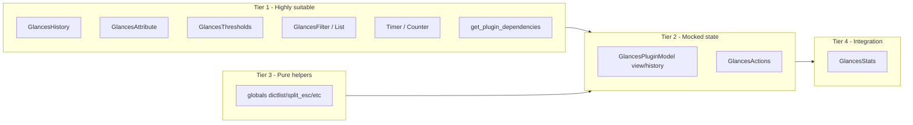

# State-based testing: components overview

This document summarises which parts of the Glances codebase are suitable for the methodology in [exploration.md](exploration.md): an agent-written randomised state-based generator that drives the public API of a component over many iterations, then uses crashes to refine specifications and find bugs.

---

## Suitability criteria (short)

- **Clear public API** that can be invoked at random (methods with defined signatures).
- **Stateful** behaviour so that random sequences of calls can reach many states and expose ordering bugs.
- **Definable preconditions** so that failures can be classified as "wrong precondition" vs "implementation bug".
- **Testable without heavy external I/O** (or with simple mocks), so that random execution is feasible.

---

## Tier 1: Highly suitable components

1. **glances/history.py – GlancesHistory**  
   API: `add()`, `reset()`, `get()`, `get_json()`. State: dict of attributes. No I/O. Good first target.

2. **glances/attribute.py – GlancesAttribute**  
   API: `value`, `history_add`, `history_reset`, `history_raw`, `history_json`, `history_value`, `history_mean`, `history_len`. Known bug in `history_mean` (denominator uses value difference instead of count).

3. **glances/thresholds.py – GlancesThresholds**  
   API: `add(stat_name, threshold_description)`, `get(stat_name)`. Preconditions: threshold_description in `['OK','CAREFUL','WARNING','CRITICAL']`.

4. **glances/filter.py – GlancesFilter / GlancesFilterList**  
   API: `filter` setter, `is_filtered(process)`. Random filter strings and process dicts.

5. **glances/timer.py – Timer and Counter**  
   API: `set`, `reset`, `finished`, `get` (Timer); `start`, `reset`, `get` (Counter). Time may need to be mocked.

6. **glances/plugins/plugin/dag.py – get_plugin_dependencies()**  
   Pure function: plugin_name + optional graph. Random plugin names and graphs.

---

## Tier 2: Suitable with injected or mocked state

7. **glances/plugins/plugin/model.py – GlancesPluginModel (view/history/alert only)**  
   Drive via `set_stats()`, `update_views()`, `update_stats_history()`, `get_views()`, `get_raw()`, `get_export()`, `get_alert()`, etc. Do **not** call `update()` (real I/O). Use one plugin (e.g. mem) with minimal init.

8. **glances/actions.py – GlancesActions**  
   API: `set`, `get`, `run`. Mock `secure_popen` so `run()` does not execute commands.

---

## Tier 3: Pure helpers (random input, no internal state)

9. **glances/globals.py**  
   `list_to_dict`, `dictlist`, `dictlist_first_key_value`, `split_esc`, `auto_unit`, etc. Random inputs to find edge cases.

---

## Tier 4: Integration-style (more setup)

10. **glances/stats.py – GlancesStats**  
    API: `load_modules`, `update_plugin`, `update`, `getPluginsList`, `get_plugin`, etc. Random sequences of update/get with minimal args and config.

---

## Coverable with mocked side effects (verified in code)

These are suitable **if** I/O or external dependencies are mocked (no constructor injection where noted; use `unittest.mock.patch` or equivalent).

- **GlancesEventsList** (glances/events_list.py) – Patch `glances.events_list.glances_processes` and `glances.events_list.glances_thresholds`.
- **GlancesProcesses** (glances/processes.py) – Patch `psutil.Process`, `psutil.cpu_count`, etc.
- **Plugins' update()** – Use `set_stats()` only (Tier 2) or patch `psutil` / `cpu_percent` per plugin.
- **GlancesActions** (glances/actions.py) – Patch `glances.actions.secure_popen`.
- **Export modules** (glances/exports/*) – Patch `self.client` or the producer class (e.g. `KafkaProducer`).
- **ThreadedIterableStreamer** (glances/stats_streamer.py) – **Constructor injection**: pass `iterable` (list or generator); no patch needed.
- **GlancesStatsClient.update()** (glances/stats_client.py) – Call `update(random_input_stats)`; no network mock needed for this method.
- **Outdated** (glances/outdated.py) – Patch `urlopen`, `open`.
- **Config** (glances/config.py) – Patch `open` or pass fake config.
- **Curses / stdout outputs** – Patch `curses` or `sys.stdout`, feed random stats.
- **GlancesSNMPClient / plugins using SNMP** – Patch `glances.plugins.plugin.model.GlancesSNMPClient`.
- **AMPs** (glances/amps/*) – Patch `glances.secure.secure_popen`.
- **Password / JWT** (glances/password.py, glances/jwt_utils.py) – Hash/check and encode/decode are deterministic; optional patch for file access.

---

## Components that cannot be covered

These remain not suitable: no testable stateful API, or unsafe (e.g. arbitrary command execution), or lifecycle/orchestration only.

1. **Entry points** – run.py, glances/__main__.py, glances/main.py (GlancesMain), glances/standalone.py.
2. **Network and process I/O** – secure_popen implementation, client.py, server.py, webserver.py, restful_api, servers_list_dynamic, plugins/ports (ThreadScanner), plugins/ip (ThreadPublicIpAddress).
3. **Server stats** – stats_server.py (no input_stats injection), stats_client_snmp.py (network-bound).
4. **Lists and discovery** – servers_list.py, servers_list_static.py, web_list.py, ports_list.py, folder_list.py, amps_list.py.
5. **API facade** – api.py (delegates to stats and live plugin updates).
6. **Display helpers** – glances_bars.py, glances_colors.py, glances_sparklines.py, glances_unicode.py, glances_mcp.py.
7. **JSON serializer** – pure transformation, not stateful; random input testing applies (Tier 3 style).
8. **CPU percent utility** – glances/cpu_percent.py (wraps psutil).

---

## Suggested order of application

1. GlancesAttribute and GlancesHistory (small, stateful; known bug in `history_mean`).
2. GlancesThresholds and GlancesFilter / GlancesFilterList.
3. get_plugin_dependencies (pure).
4. GlancesPluginModel with `set_stats` only (e.g. mem plugin).
5. GlancesActions with mocked `secure_popen`.
6. globals helpers and GlancesStats.

---

## Diagram (component vs suitability)

